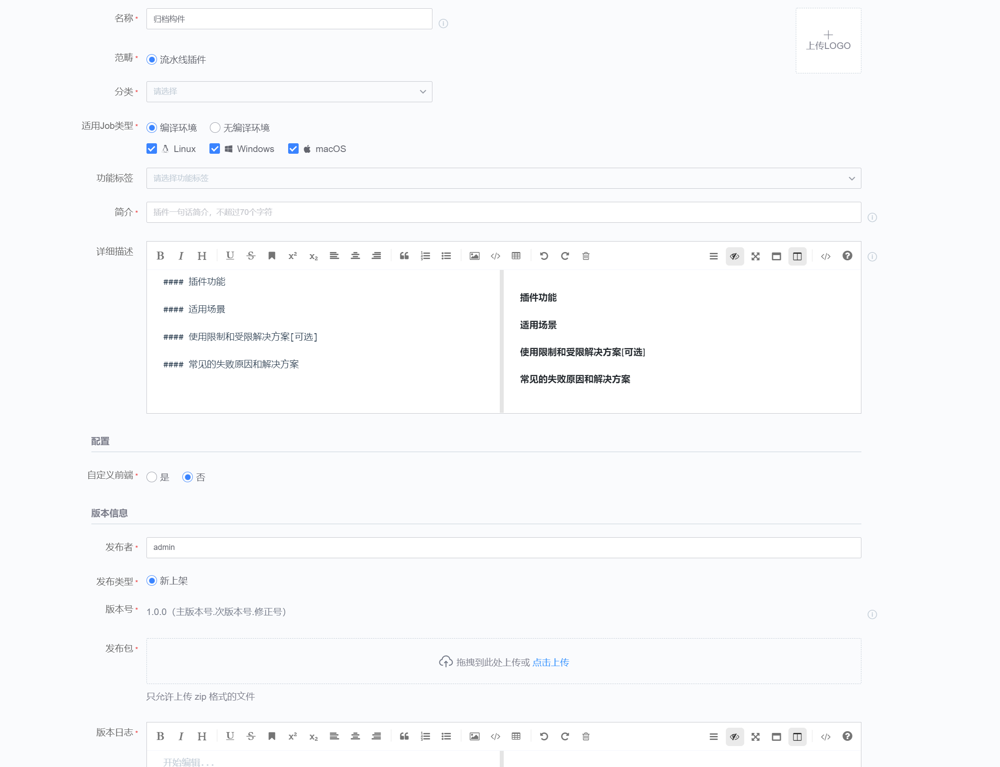
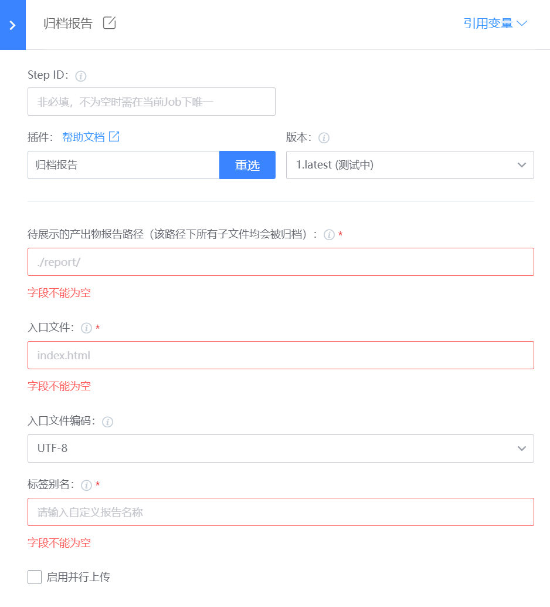

# 归档报告
将构建机上的报告归档到制品库

## 使用指南
### 一、新增插件
在蓝盾的研发商店->工作台->新增插件 页面

各字段值填写如下:

名称: 归档报告（这个可以自定义)

标识: uploadReport

调试项目: 选择自己的项目

开发语言: java

自定义前端: 否

### 二、发布管理
新增插件后，就会跳转到插件发布管理界面,点击"上架”

### 三、上架插件

步骤:

1.上传插件图标,插件图标可以直接使用[uploadReport](images/uploadReport.png)

2.插件job类型,linux、macos、windows都选上

3.上传插件包，插件包从[releases](https://github.com/TencentBlueKing/ci-uploadReport/releases)下载最新版本插件zip包

4.填写发布日志

### 四、配置插件
当插件上架后，就可以在流水线中选择插件，插件配置如下:

- 产出物报告路径(fileDir): 归档当前工作空间相对路径或绝对路径目录下的报告文件，该路径下的所有文件都会被归档
- 入口文件(indexFile): 指定入口文件名
- 入口文件编码(indexFileCharset): 指定入口文件的编码类型
- 标签别名(reportName): 指定报告名称
- 并行上传(isParallel): 启用后并行上传报告文件